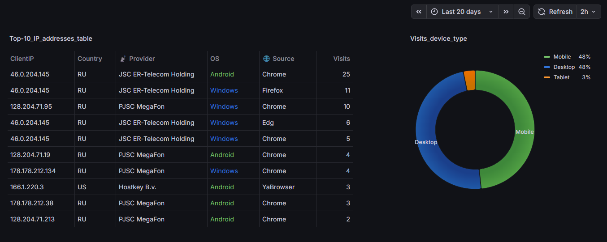
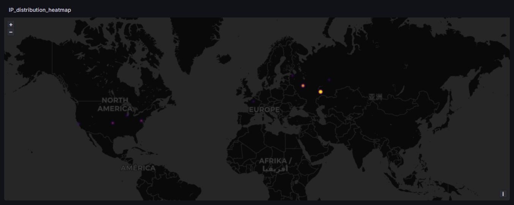
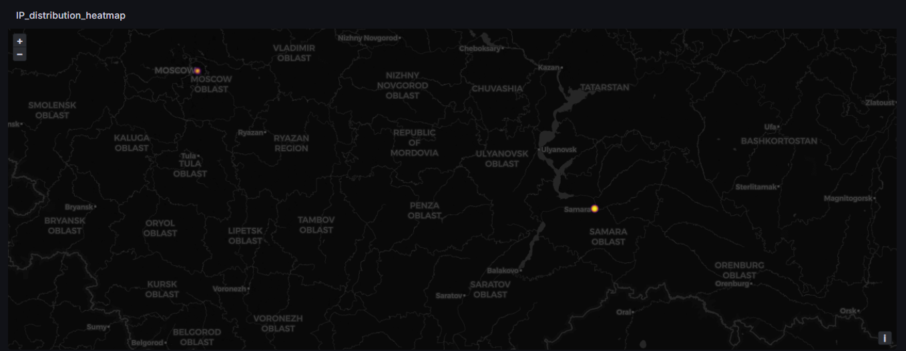

# Hello, World!

Данный проект, визуально представляющий из себя одностраничное приложение с fetch-запросами, является своеобразной “пробой пера” начинающего web-программиста.

## Описание

* <b>Фреймворк:</b>&emsp;ASP.NET Core
* <b>Архитектура:</b>&emsp;Monolith
* <b>Шаблон проектирования:</b>&emsp;MVC
* <b>База данных:</b>&emsp;MySQL
* <b>Логирование:</b>&emsp;Serilog

## Production Lifecycle

* <b>Способ развертывания:</b>&emsp;GitHub Actions
* <b>Хостинг:</b>&emsp;VPS Beget *(Ubuntu, ver. 22.04.5)*
* <b>Среда исполнения:</b>&emsp;ASP.NET Core *(ver. 8.0.24)*
* <b>Администрирование:</b>&emsp;systemd / ISPmanager *(ver. 6)*

## Observability

* OpenTelemetry *(сбор метрик)*
* Prometheus
* Loki
* Alloy
* Grafana

 

&emsp;
⚙️ <b>Важный момент при клонировании репозитория</b>

&emsp;1. Откройте терминал в корне проекта (там, где лежит файл "MVC.sln").

&emsp;2. Введите команду `git config core.hooksPath .github/hooks`.

&emsp;3. Осуществите проверку: введите команду `git config core.hooksPath` &mdash; если терминал в ответ напишет ".github/hooks", значит, настройка применилась.

&emsp;Указанная настройка позволяет git-системе использовать авторский "post-checkout"-хук для очистки актуальной ветки от результатов старых VS-компиляций. Необходимость данной манипуляции в скором времени будет описана в разделе "🎓 <b>Challenges</b>".

 

&emsp;
🔒 <b>Безопасность</b>

&emsp;Информация будет представлена в скором времени. Спасибо за ожидание!

 

&emsp;
⚡ <b>Оптимизация</b>

&emsp;Информация будет представлена в скором времени. Спасибо за ожидание!

 

&emsp;
🎓 <b>Challenges</b>

&emsp;Информация будет представлена в скором времени. Спасибо за ожидание!

&emsp;*Текста будет много...* 🙂

 

&emsp;
❓ <b>Ответы на возможные вопросы</b>

&emsp;Информация будет представлена в скором времени. Спасибо за ожидание!

 

В заключение представлю скриншоты мониторинга проекта из вышеупомянутой Grafana...

*<b>Скриншот №0</b>:&ensp;Дашборд_таблица_с_круговой_диаграммой*

На скриншоте под номером "0" показаны:
* таблица "Топ-10" IP адресов, чаще всего посещающих сайт, с определением страны, интернет-провайдера, операционной системы и браузера
* круговая диаграмма групп устройств, с которых осуществляются запросы к сайту
  

*<b>Скриншот №1</b>:&ensp;Дашборд_тепловая_карта*

На скриншоте под номером "1" показано распределение IP адресов, посещающих сайт, на тепловой карте.
  

*<b>Скриншот №2</b>:&ensp;Дашборд_тепловая_карта_Самара*

На скриншоте под номером "2" приведено географическое уточнение плотности запросов: большинство IP адресов базируются в Самаре. Так и есть, потому что значительная часть запросов к сайту исходят от меня, автора проекта.
  

## Добро пожаловать!